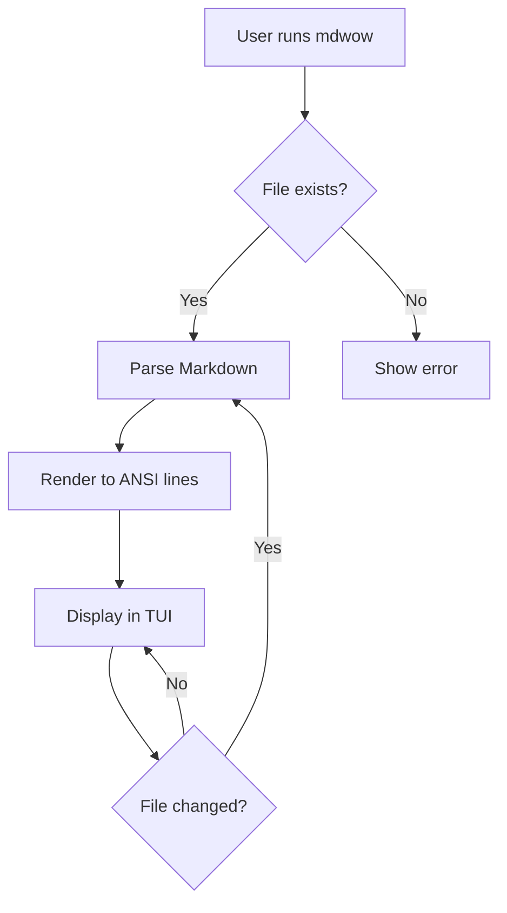
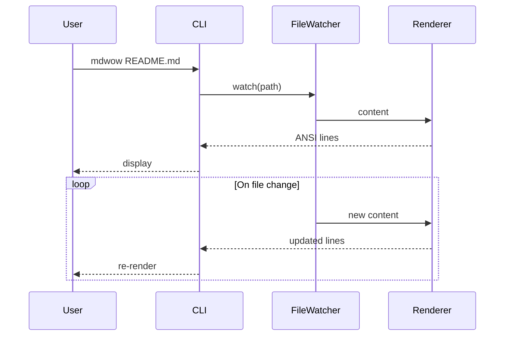
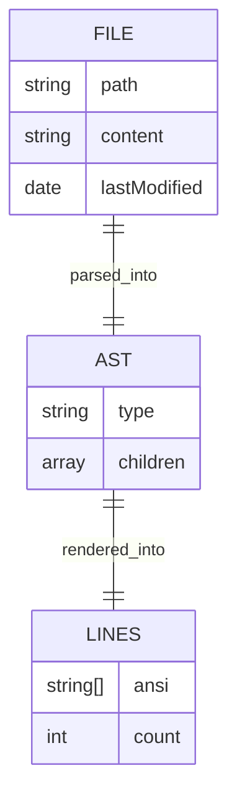
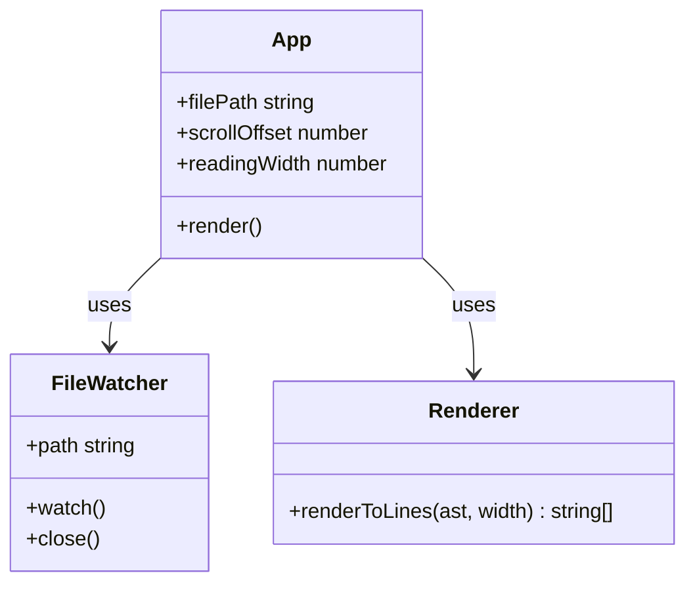

# mdwow Test Document

A comprehensive test file covering all supported Markdown elements.

👉 Click [README.md](./README.md) to open it as a floating preview.

---

## Text Formatting

Plain paragraph with **bold text**, _italic text_, ~~strikethrough~~, and `inline code` all in one line.

Nested styles: **bold with _italic inside_** and _italic with **bold inside**_.

A longer paragraph to test word wrapping behavior. The quick brown fox jumps over the lazy dog. Pack my box with five dozen liquor jugs. How vexingly quick daft zebras jump.

> A blockquote with **bold** and _italic_ and `code` inside it.
> It can span multiple lines and should render with a colored left border.

> Nested blockquote level one.
>
> > Nested blockquote level two, indented further.

---

## Headings

# Heading 1
## Heading 2
### Heading 3
#### Heading 4
##### Heading 5
###### Heading 6

---

## Lists

### Unordered

- Item one
- Item two
  - Nested item A
  - Nested item B
    - Double nested item
- Item three with **bold** and `code`

### Ordered

1. First step
2. Second step
   1. Sub-step one
   2. Sub-step two
3. Third step

### Mixed

- Unordered parent
  1. Ordered child one
  2. Ordered child two
- Another unordered parent

---

## Code

### Inline

Use `npm install` to install dependencies, then run `npm test` to execute the test suite.

### JavaScript

```js
function greet(name) {
  const message = `Hello, ${name}!`;
  console.log(message);
  return message;
}

greet('world');
```

### TypeScript

```typescript
interface User {
  id: number;
  name: string;
  email?: string;
}

function getUser(id: number): Promise<User> {
  return fetch(`/api/users/${id}`)
    .then((res) => res.json());
}
```

### Shell

```bash
#!/usr/bin/env bash
set -e

echo "Building project..."
npm run build

echo "Running tests..."
npm test

echo "Done!"
```

### Python

```python
def fibonacci(n: int) -> list[int]:
    seq = [0, 1]
    while len(seq) < n:
        seq.append(seq[-1] + seq[-2])
    return seq[:n]

print(fibonacci(10))
```

---

## Tables

### Simple

| Name    | Age | Role       |
|---------|-----|------------|
| Alice   | 30  | Engineer   |
| Bob     | 25  | Designer   |
| Charlie | 35  | Manager    |

### Wide

| Package       | Version | License | Description                          |
|---------------|---------|---------|--------------------------------------|
| ink           | 5.0.1   | MIT     | React-based TUI framework            |
| remark-parse  | 11.0.0  | MIT     | Markdown parser                      |
| chokidar      | 3.6.0   | MIT     | Cross-platform file watcher          |
| chalk         | 5.3.0   | MIT     | Terminal string styling              |
| meow          | 13.2.0  | MIT     | CLI argument parser                  |

### With Formatting

| Feature          | Status  | Notes                        |
|------------------|---------|------------------------------|
| Live reload      | ✅ Done  | Uses chokidar                |
| Mouse scroll     | ✅ Done  | SGR mouse reporting          |
| Reading width    | ✅ Done  | `+` / `-` keys               |
| Syntax highlight | ⏳ Soon  | Planned for v2               |
| Remote URLs      | ❌ No    | Local files only             |

---

## Links and Images

A link to [GitHub](https://github.com) and another to [the Ink repo](https://github.com/vadimdemedes/ink).

An image (rendered as alt text): 

---

## Horizontal Rules

Above this line is content.

---

Below this line is more content.

***

Triple asterisk also works.

---

## Mermaid Diagrams

> **Note:** mdwow renders mermaid blocks as code — use a Mermaid-aware renderer to visualize them.

### Flowchart



### Sequence Diagram



### Entity Relationship



### Class Diagram



---

## Edge Cases

### Empty code block

```
```

### Long unbroken string

`averylongidentifierthatexceedsthelinewidthandshouldbetrunatedorgracefullyhandled`

### Special characters

Ampersand & angle brackets < > and quotes " ' should render correctly.

Unicode: 中文 日本語 한국어 العربية émojis 🎉 🚀 ✨

### Deep nesting

- Level 1
  - Level 2
    - Level 3
      - Level 4
        - Level 5

---

_End of test document._
